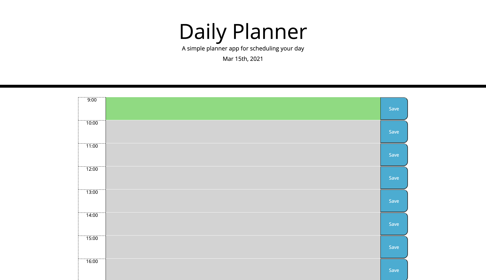
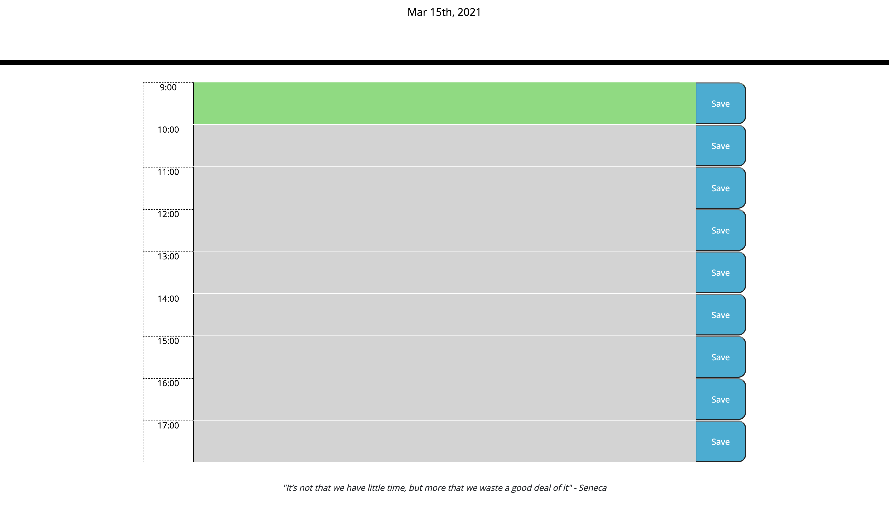

# Daily Planner

## Description
Having trouble keeping track of your work day? Look no further! This basic web app provides a simple way to write and save tasks according to time and keep track of where you are in the day!

## Deployment

[Deployed Site](https://jareddeuriarte.github.io/daily-planner/)

[GitHub Repo](https://github.com/jareddeuriarte/daily-planner)

## Features
- Save tasks and/or notes 
- Color changing system to gauge past, present, and future tasks
- A quote for inspiration

## Credits
Namita Shenai and Stacey McQuade

